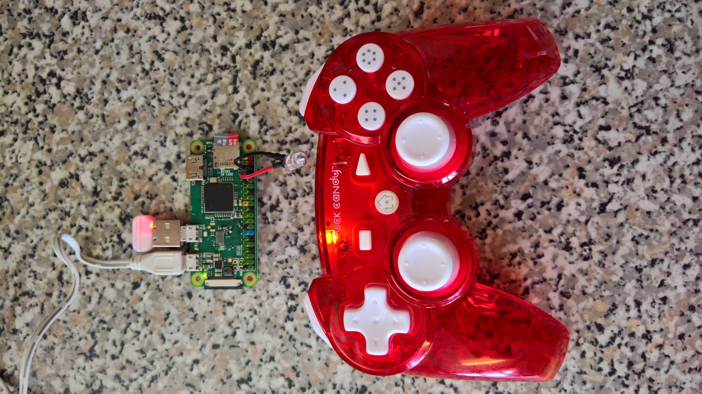

# Robosapien V2 controlled with a Raspberry Pi, IR LED and Rock Candy Controller

## You will need:  
  
A Raspberry Pi  
An IR LED  
A Rock Candy Controller  



## Install instructions
  
Using Raspian Stretch Lite (26/6/18)

```
cd
sudo apt-get update
sudo apt-get install lirc
sudo apt-get install git
sudo apt-get install python3-pip
sudo pip3 install inputs

git clone https://github.com/steveamor/RobosapienV2.git
sudo cp ~/RobosapienV2/lircd.conf /etc/lirc/
```

Update ```/etc/rc.local``` with the following three lines before ```exit 0```

```
ln -s /dev/lirc0 /dev/lirc # this is the hack that fixes the "hardware does not support sending" error
lircd &
python /home/pi/RobosapienV2/RSV2.py &
```

Ensure ```/boot/config.txt``` has the following line in it

```
dtoverlay=lirc-rpi,gpio_out_pin=14
```

Ensure ```/etc/lirc/hardware.conf``` contains the following

```
LIRCD_ARGS="--uinput"
#START_LIRCMD=false
#START_IREXEC=false
LOAD_MODULES=true
DRIVER="default"
DEVICE="/dev/lirc0"
MODULES="lirc_rpi"
LIRCD_CONF=""
LIRCMD_CONF=""
```

In ```/etc/lirc/lirc_options.conf``` change ```driver = devinput``` to ```driver = default```

Connect the long leg of the IR LED to GPIO14 and the short leg to GND (you don't need a current limiting resistor).

## Robosapien V2 Troubleshooting

[Link](notes.md)

