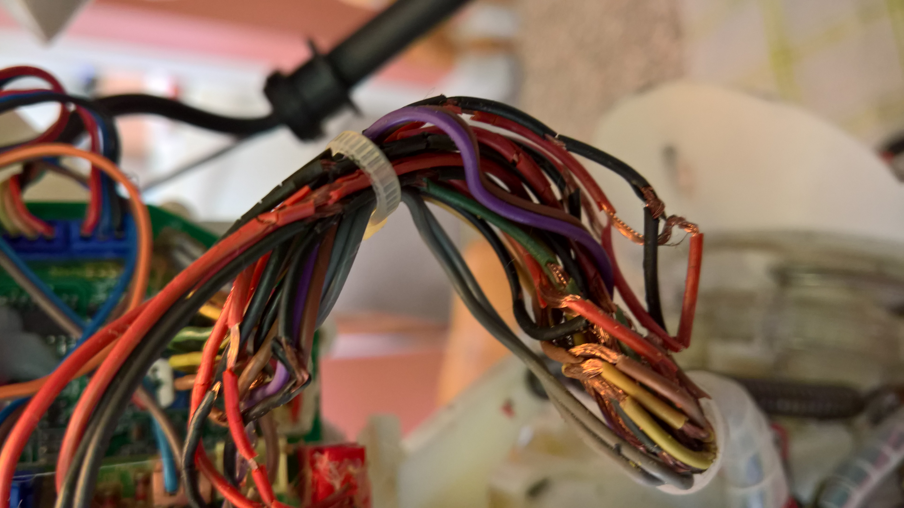
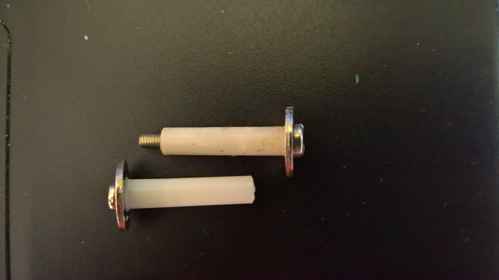

# Notes for repairing a Robosapien V2

## Bad Insulation

There is a known problem where the insulation on the wires crumbles away and causes short circuits.  
When you switch on the Robosapien V2 it might say "I think I have a bad motovator" and you might see some smoke.  
There are 25 wires to replace. I used 22AWG servo wire. 5m of 3 core servo wire will be sufficient, using 65cm lengths for the batteries and the motors and 50cm lengths for signals. For the two main power connections, I used new connectors. They are JST XH 3S balance connectors. 

## Eyes Permanently lit

The six D cells provide 9V of power to control the motors. If the robot powers up with its eyes permanently lit and no speech or movement, the 9V is not getting to the main board. It's likely the connector on the main board is broken or a wire is broken.

## Broken pegs in leg

It's easy to fix the plastic pins that hold the top of the legs to the hip. Just screw an M3 screw all the way through and screw the whole lot back into the hip.

## Useful links

[Battery covers](https://www.thingiverse.com/thing:3038339)

[Arduino sketch](https://github.com/SovGVD/robosapien_v2)

[Wire replacement video](https://www.youtube.com/watch?v=LQjDyu8Cn2U)

[Robosapien V2 IR codes](http://www.aibohack.com/robosap/ir_codes_v2.htm)

[Robosapien V2 Troubleshooting](http://www.robotsandcomputers.com/robots/manuals/RSv2_trouble.pdf)

[Robosapien V2 User manual](http://www.theoldrobots.com/images7b/Robosapien_V2_Manual.pdf)

